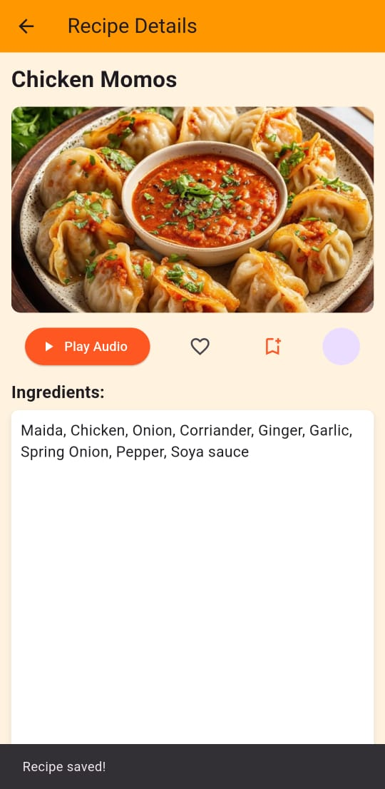
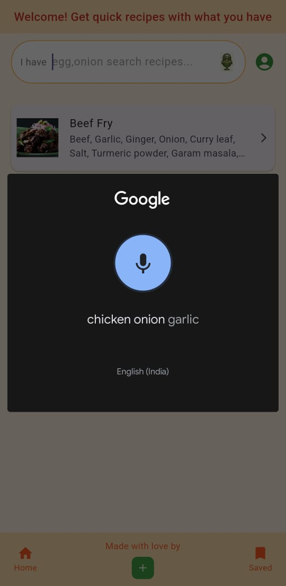
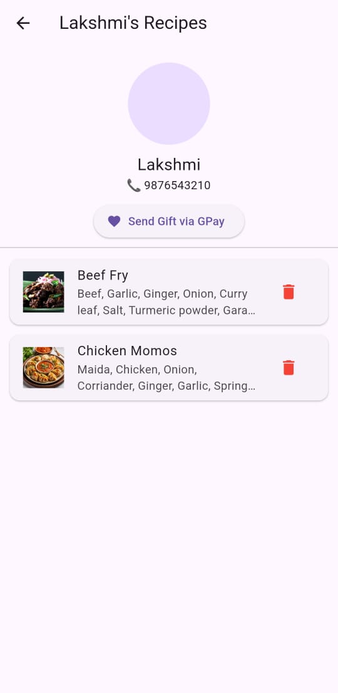

# 🍳 VoiceCook v1

**Quick Recipes. Local Flavors. Zero Hassle.**

VoiceCook is a Flutter app that helps people cook faster — search by voice, upload recipes, and get clear ingredient + step info without long videos.

---

## ✨ Why VoiceCook?
- **Save Time** — Skip the 40-minute video and get the recipe in minutes.  
- **Clear & Fast** — Ingredients + steps upfront, no fluff.  
- **Voice Guidance** — Even complete beginners can follow along.  
- **Explore Local Recipes** — Discover native dishes in minutes.  
- **Easy Upload** — Share your recipe in a few taps.  
- **Save for Later** — Bookmark recipes for future cooking.

---

## 📸 App Tour
- **Home (voice search + recipes)**  
  

- **Recipe detail (bookmark/save)**  
  

- **Saved recipes list**  
  

- **Upload a recipe**  
  

- **Voice search (speech → text)**  
  

- **Creator profile (creator info & gifts)**  
  

---

## 🛠 Tech
- Flutter (Dart)  
- Hive (local storage)

---

## 🚀 Download & Try
APK (v1): [Download VoiceCook v1 APK](https://github.com/nandhana-dev/voicecook/releases/download/v1.0/voicecookv1.apk)

---

## 📜 License & Ownership
Copyright © 2025 Nandhana.  
This project is my personal work — please contact me before reusing or republishing any part of this code or app.

---

## 💡 Future Plans
- Monetization for creators (paid per audio play)  
- Likes, engagement metrics & creator revenue share  
- Live chat between users and creators

---

> VoiceCook isn’t just a recipe app — it’s a shortcut to flavor, and the kitchen’s new best friend. 😉

