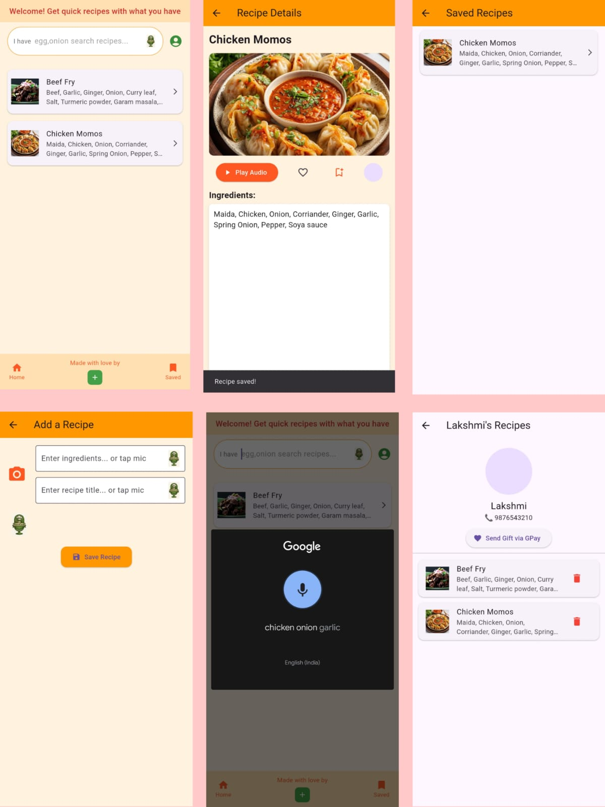

# 🍳 VoiceCook 

<p align="center">
  
  
</p>

**Quick Recipes. Local Flavors. Zero Hassle.**

VoiceCook is a high-performance Flutter application designed to bridge the gap between complex video tutorials and efficient cooking. It leverages voice-guided search and a "no-fluff" UI to provide ingredients and steps instantly.

---

## ✨ Key Features

- 🎙️ **Voice-Driven Experience** — Hands-free navigation designed for busy kitchens.
- ⚡ **Instant Access** — Skips long video intros; get straight to the ingredients and steps.
- 🌍 **Local Gastronomy** — Specialized discovery of native and regional dishes.
- 📤 **Recipe Contribution** — Seamless upload flow for creators to share their culinary magic.
- 💾 **Offline Ready** — Powered by **Hive** for fast local storage and bookmarking.

---

## 📸 App Showcase

<p align="center">
  
</p>

---

## 🔮 Future Plans
- [ ] **Monetization Engine** — Implement pay-per-audio-play for content creators.
- [ ] **Engagement Analytics** — Social metrics including likes, shares, and creator revenue dashboards.
- [ ] **Community Hub** — Real-time chat functionality between users and culinary creators.

---

## 🛡️ License
**Copyright © 2025 Nandhana.** All rights reserved.  
Proprietary work. Unauthorized copying or distribution is prohibited. [Inquiries](mailto:nandhanaprabhar231@gmail.com).

---

## 🚀 Technical Setup

### Prerequisites
* Flutter SDK (Latest Version)
* Dart SDK

### Installation
```bash
# Clone the repository
git clone [https://github.com/nandhana-dev/voicecook.git](https://github.com/nandhana-dev/voicecook.git)

# Navigate to project folder
cd voicecook

# Install Flutter dependencies
flutter pub get

# Run the app
flutter run
